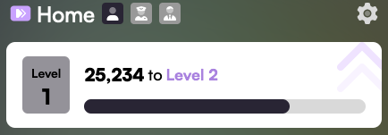
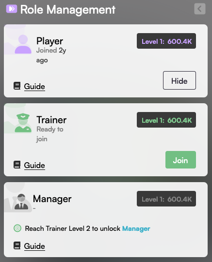

# 🔐 Using Roles

## Unlocking Roles

The first step to unlock a role is to click the gear icon on the home screen.

<figure><figcaption></figcaption></figure>

Click on "Role Management" to open the following screen

<figure><figcaption></figcaption></figure>

Here you can see if you meet the requirements for an advanced role. Once you join an advanced role, your score and level will be 0 for that role until you receive evaluations from a Manager.

You can temporarily hide a role from here if you don't want to see it in the app.

The top bar of the home screen will show icons for all your visible roles.

<figure><figcaption></figcaption></figure>

Clicking a role icon will switch the view to show your score, level, activity, and evaluations for that role. The "Evaluate" tab will show a list of people you can evaluate when acting in that role.\
\
When viewing someone's profile, you can click an icon to view their activity and evaluations for any role they have (Subject, Player, Trainer, or Manager), and to evaluate them for that role (if you have the proper role unlocked).

<figure><figcaption></figcaption></figure>
