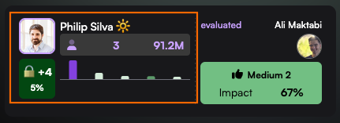

# 🪪 Participant Cards

Connections and evaluations in Aura are represented by cards showing evidence of the trustworthiness of both participants.

## Evaluation cards

<figure><figcaption>
An evaluation card shows the trustworthiness of both participants
</figcaption></figure>

The right side of the card shows how an evaluator evaluated a subject. In this case, Philip evaluated Ali positively and had medium confidence in his own evaluation. This evaluation contributed 67% towards Ali's score and level as a subject.

<figure><figcaption>
The left side of a card tells us about the evaluator
</figcaption></figure>

The left side of a card helps you know if the evaluator has a good reputation. If so, you can use their evaluation as evidence. If not, you should ignore it.

This card shows us that Philip is a player 👤 with a level of 3 and a score of 91.2M. [The impact bar chart](impact-bar-chart.md) below this shows the five most impactful evaluations of Philip as a player. The purple bar is your evaluation of Philip as a player.\
\
The lower left section is your interaction with Philip. You gave Philip a positive (+) player evaluation with high confidence (4). Your evaluation had a 5% impact. Philip connected to you with "Recovery" 🔒.

## Connection cards

<figure><figcaption>
An example connection card
</figcaption></figure>

The left side of a connection card is very similar to the left side of an evaluation card. You can see what you and other Aura participants think about the trustworthiness of the person making the connection. This helps determine whether or not the connection came from a fake or duplicate account.

In this case, you connected to Han with "Already Known" 😎 and evaluated him positively with a low confidence, resulting in a 12% impact on his score.\
\
In the [impact bar chart](impact-bar-chart.md), you can see the eight most impactful evaluators of Han, which resulted in his Subject level of 4 and score of 1.6B.


[impact-bar-chart.md](impact-bar-chart.md)


## Participant Details

By clicking on the left side of a card, you can see even more detail about a person in any of their [Aura roles](../roles/using-roles.md) and a larger version of the [impact bar chart](impact-bar-chart.md). From the participant details modal, you can also switch to that person's profile or update your evaluation of them.

