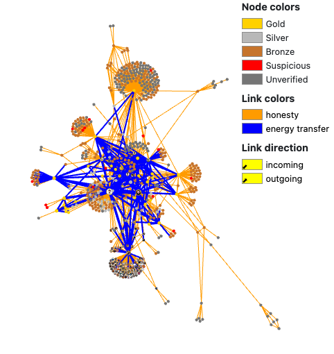

# 🫧 Aura Graph Explorer

### [Old Aura Explorer](https://explorer.brightid.org/?aura=aura)



### New Explorer

The new graph explorer (as yet unreleased) is tailored to Aura's use of roles. It will show the role relationships between participants and the impacts of evaluations.

### Viewing a specific person

On a subject's profile, click "View on Explorer" to view how Aura players have evaluated them.&#x20;

### Comments

Players can leave comments or ask questions about a person or group of connected people on the graph by placing dots around a region or node with shift-click.  Other players can then respond.

#### Reasons for comments

Players may want to ask how they can make a connection to a region to do more research.  They may want to flag a certain region as suspicious, or ask for more information about it.
