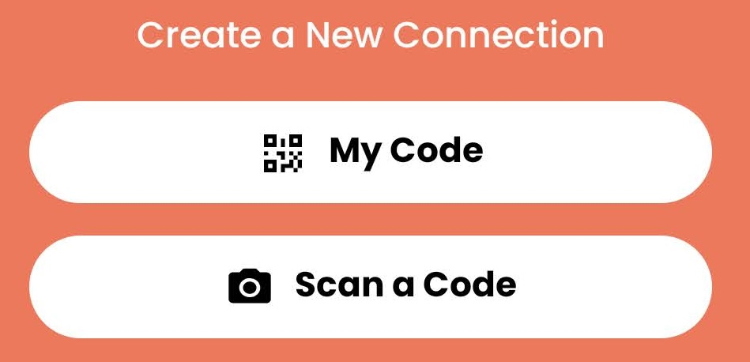
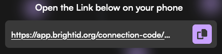
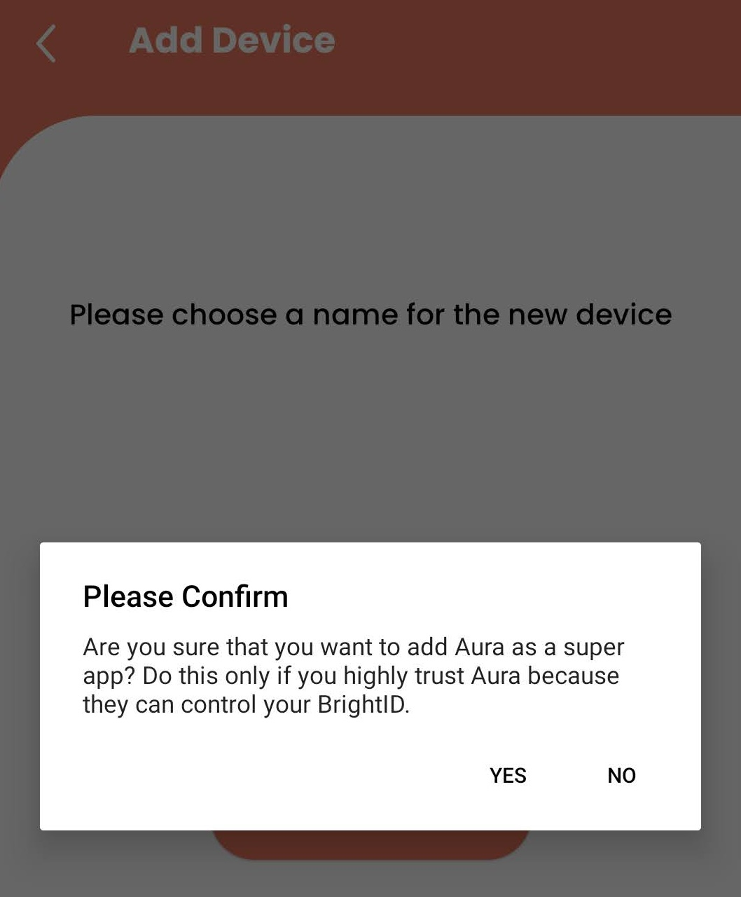
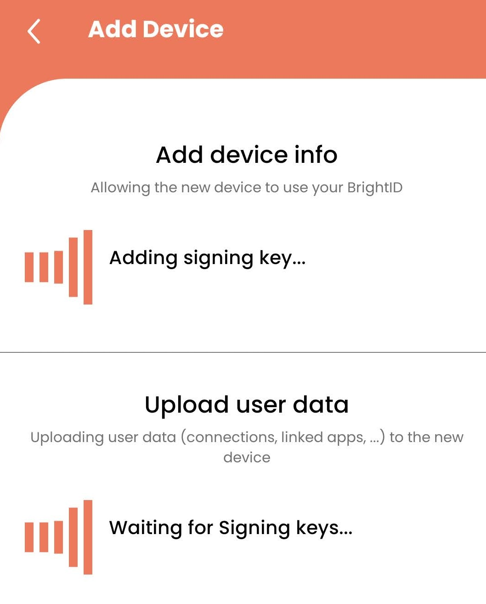
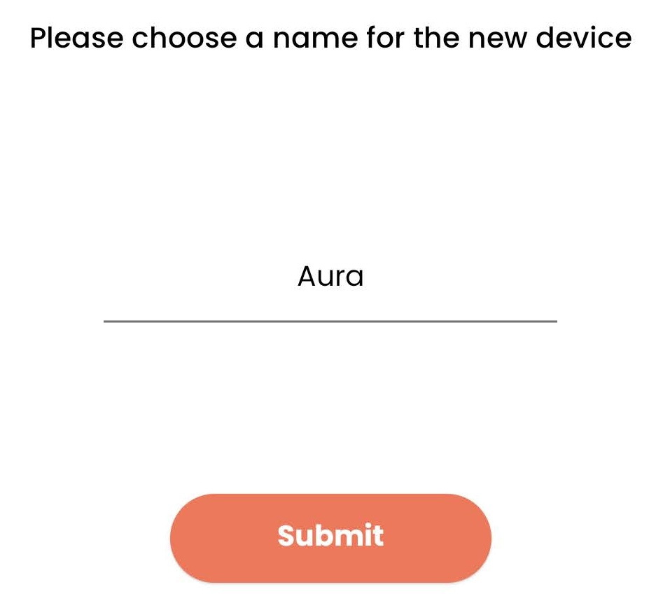

# 🗝️ Aura login

## [Go to the Aura app](https://aura.brightid.org) 



### If you're on a computer

1. Open BrightID on your mobile device
2. Choose "Scan a code" from the home screen

<figure><figcaption></figcaption></figure>

3. Scan the code on the Aura login screen

<figure><figcaption></figcaption></figure>

### If you're on your mobile device

* Click the link on the Aura login screen

<figure><figcaption></figcaption></figure>

## Add Aura as a super app BrightID device

You will see these screens on the BrightID app after you scan or click the code.

<figure><figcaption></figcaption></figure>

<figure><figcaption></figcaption></figure>

Name the super app device you've created. You can name it "Aura" as suggested or you can include a browser and device in the name such as "Aura-Chrome-Laptop" if you plan to use Aura from multiple devices.

<figure><figcaption></figcaption></figure>

Now Aura can see all of your BrightID names and photos and allow you to make special BrightID connections called "Evaluations" from the Aura app.

You will now be logged in to Aura, and the screen on the Aura app will change to the [Home screen](../how-to-play/home-screen.md).&#x20;


[home-screen.md](../how-to-play/home-screen.md)

