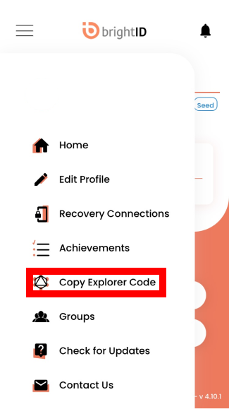
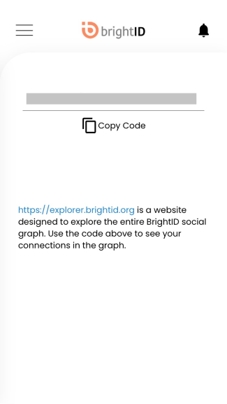
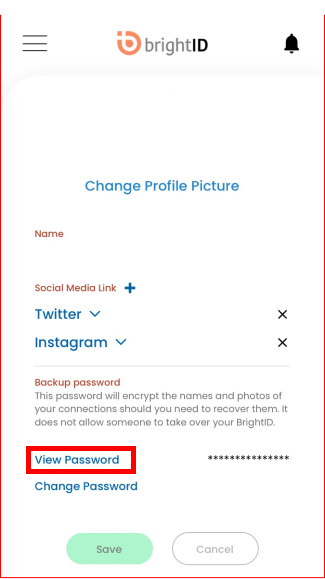

# 🗝️ Aura login

To access Aura, use your BrightID Explorer Code and Password.

.png>)

Follow the steps below to locate them.

### Finding your explorer code and password

#### Explorer code

* In the BrightID mobile app, click the menu button at the top left.
* Click "Copy Explorer Code."

* Click the "Copy Code" Button.

#### Password[​](https://elated-murdock-5004e1.netlify.app/docs/aura-getting-started/login#password) 

* In the BrightID mobile app, click the menu button at the top left.
* Click "Edit Profile."

.png>)

* Click "View Password"

