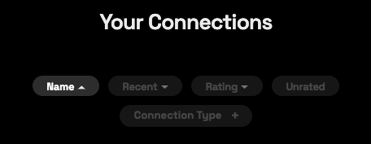
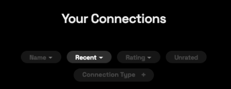
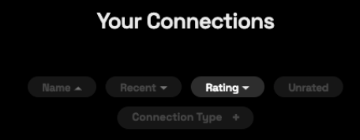
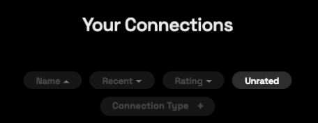
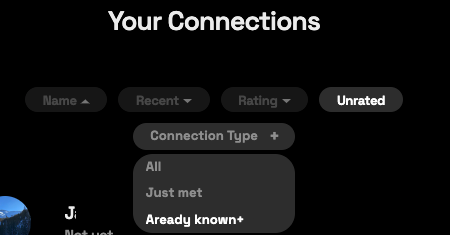

# 🫧 Connections

Connections are people you have connected to on [BrightID](../getting-started/get-brightid.md).  You can [rate their honesty](honesty.md) to help them get [verified](verification-levels.md).

### Search for connections

.png>)

#### By BrightID name

Search for your connections by BrightID user name in the top search bar.

#### By nickname

.png>)

You can update the nickname of any of your connections from their profile page, and search by this name along with their default BrightID name.

### Filter and sort connections

Use the buttons at the top of the Connections page to locate specific users.

#### Name

Order connections by alphabetically by name.

#### Recent

Order by recent connections ascending or descending.

#### Rating

Order by honesty rating.

#### Unrated

Filter by unrated connections.

#### Connection type

Filter by connection type.

