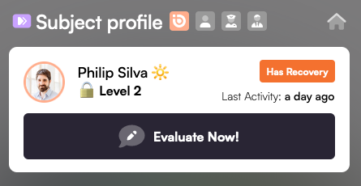
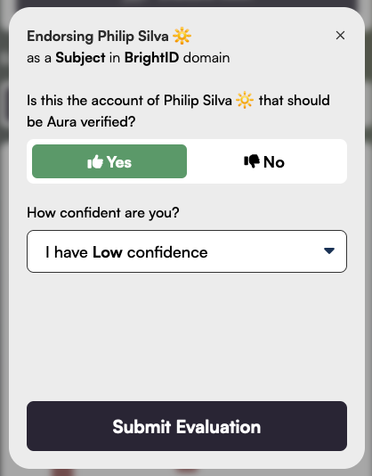
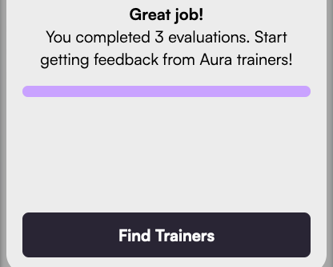

# 🙍 Subject Profile

<figure><figcaption></figcaption></figure>

From the subject profile screen, you can evaluate one of your BrightID connections.

<figure><figcaption></figcaption></figure>

Choose a confidence level from "Low" to "Very High."  Be careful not to overstate your confidence--[Aura Trainers](../advanced-roles/trainers.md) will review your evaluations for accuracy.

Once you've submitted three evaluations, you've unlocked the ability to level up by having Trainers review your work.

<figure><figcaption></figcaption></figure>
