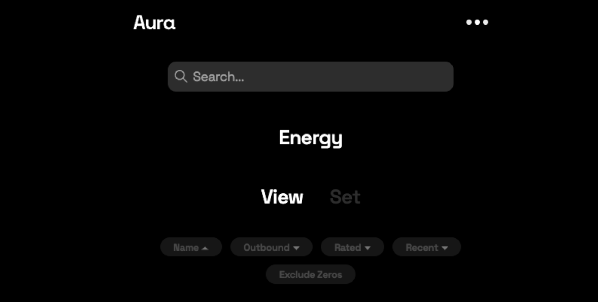
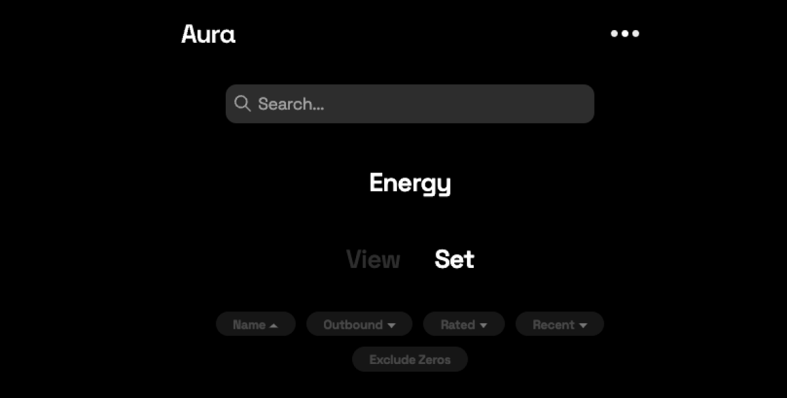
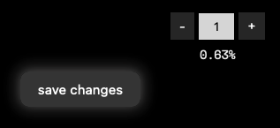

# ⚡ Energy

## Energy

Energy measures the ability of an Aura player to verify people, and how well other Aura players think they play the game. Aura players get energy from other Aura players.\
\
You should allocate energy to other Aura players based on how well they play Aura.

### Energy flows

You can see how much energy is flowing to and from you from the [explorer view](research-tools/explorer-view.md).  How much energy flows to you from another player depends on how much energy they had and what percentage of their energy they allocated to you.  Energy starts with [energy teams](../background/energy-teams.md).

### Search for a player

Use the search bar at the top of the page to locate a specific player.

.png>)

### View energy

View inbound/outbound energy allocations between you and other Aura players.

### Set energy

Allocate energy to other Aura players.

### How to allocate energy

#### Who can receive energy

You can allocate energy to any connection you've given an honesty rating of at least "1". You should only allocate energy to someone you know will play the Aura game--otherwise you're wasting energy and others may decrease their energy allocation to you.

.png>)

#### Percentage allocations

As soon as you allocate any energy, 100% of your energy will be allocated. Use ➖ and ➕ to change your allocation to a player or type in a value. The total allocation (shown at the top) may change, but the total of the percentages (shown below each allocation) will always be 100%.

#### Saving your allocations &#x20;

<figure><figcaption></figcaption></figure>

When you're satisfied with any changes you've made to energy allocations, hit the "save changes" button.
