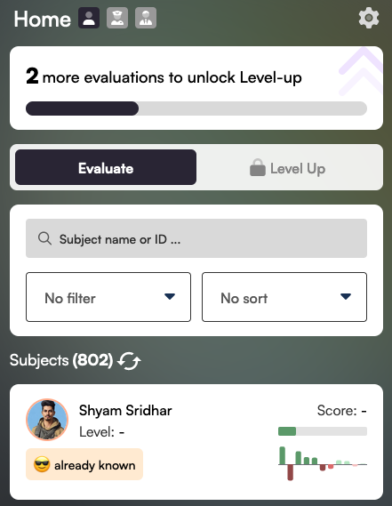

# 🏡 Home screen

## Evaluate

The first thing you'll do as a new Aura Player is evaluate the people you've connected to in the BrightID mobile app.

These "Subjects" are your friends and family that will receive Aura verifications after you and others evaluate them.

<figure><figcaption></figcaption></figure>

As [Aura Trainers](../advanced-roles/trainers.md) submit positive evaluations of you, your Aura Player score and level will increase. The higher your Player level, the greater your ability will be to help people get verified.&#x20;

Your BrightID connections will show in the list of "Subjects." Click one to see their [subject profile](connections.md) and evaluate them.
