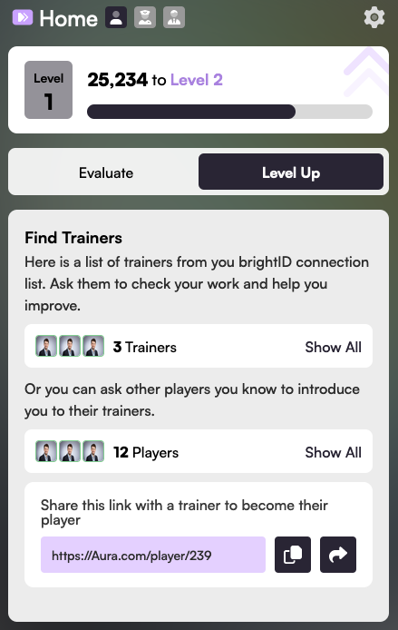

# ⬆️ Level Up

The "Level Up" tab of your home screen will tell you what to do to reach the next Aura Player level. A higher level will improve your ability to verify other people.

You level and score are based on evaluations from [Aura Trainers](../advanced-roles/trainers.md).

You unlock the ability to be evaluated by Trainers once you've made your third evaluation.

## Finding Trainers

<figure><figcaption></figcaption></figure>

The Level Up tab will show which of your BrightID connections are Trainers. It will also show which of your connections are Players, so that you can find Trainers through them.

You should contact Trainers and ask them to review your evaluations.&#x20;

## Viewing your Evaluations

Once you've received an evaluation from a Trainer, you'll see your evaluations in the "Level Up" tab. If you're evaluation is low, you can ask the Trainer what you can do to improve it.
