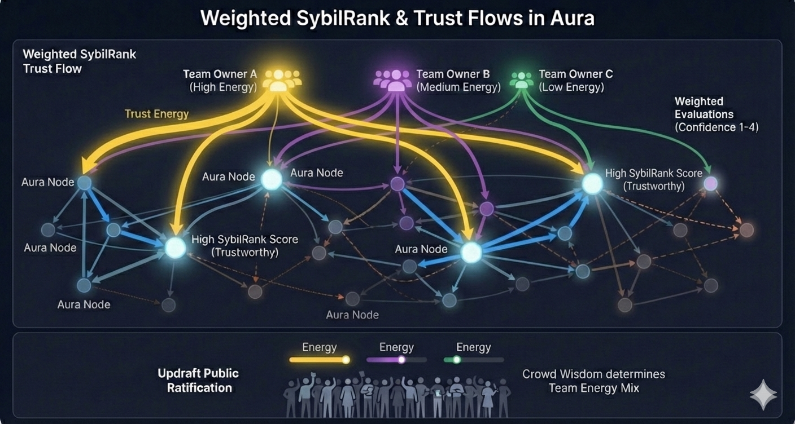

# ✨ Features

## Expert Evaluations

The goal of Aura is to provide expert evaluations to other apps. In the BrightID domain, an expert evaluation answers whether a BrightID is a person's single allowed account or a duplicate. In other domains, other kinds of expert evaluations are possible.

## Privacy

BrightID activity is a primary source of verification information in Aura. Aura inherits the same privacy rule as BrightID: no information should be shared with anyone that doesn't already know it.

Aura relies on verification by people that already know the person being verified. This is in contrast to privacy-invading verification methods which require providing personal information to someone who doesn't already know it.

## Sybil battleground 

Aura hosts the best motivated, best equipped, and most capable [sybil defenders](https://en.wikipedia.org/wiki/Sybil_attack). Sybil defense moves from casual BrightID users to elite Aura [Players](/broken/pages/pcTnjJ1JnXpuqZUHjgtU), [Trainers](../roles/trainers.md), and [Managers](../roles/managers.md). Sybil attackers are forced to target highly-skilled Aura participants rather than BrightID users.

## Accountability

Aura participants have skin in the game. Performing poorly in a role or participating in an attack will result in a poor or negative evaluation, which will quickly drop the score of a participant to a level where they can no longer influence decisions.

## Resilience

The ability of evaluators to react quickly to lower the score of an attacker or someone making critical mistakes is a key feature of Aura. A large sybil attack can be stopped quickly with a single evaluation change.

[Coexisting teams](../roles/teams.md) add resilience as does the ability to fork and spin up new [leagues](../roles/teams.md#leagues).


[teams.md](../roles/teams.md)


## Decentralization

Aura offers redundancy against serious attacks through the existence of multiple [teams](../roles/teams.md). Aura players belong to multiple teams--even if they're not aware of it. If a team becomes compromised, a [league](../roles/teams.md#leagues) will exclude it and Aura will continue to operate using the other teams.

Managers can add new managers in a decentralized way using a [transitive trust calculation](../roles/managers.md#manager-scores). Anyone can start participating in Aura and seek evaluations from existing participants.

<figure><figcaption></figcaption></figure>

## Rewards

Scores resulting from participants evaluating each other provide a convenient scale for monetary rewards to be distributed to participants within a [team](../roles/teams.md).

[Leagues](../roles/teams.md#leagues) are responsible for marketing [expert evaluations](how-aura-works.md#expert-evaluations) to apps that need them and distributing the money collected to teams in proportion to the value they bring.

### Scaling to new Regions

In the BrightID domain, apps seeking to expand into regions can pay [leagues](../roles/teams.md#leagues) to cover those regions. The need for verification in a region drives well-connected users to learn to become Aura players.&#x20;
